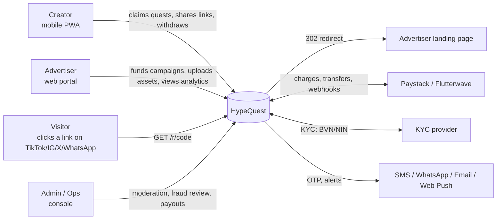
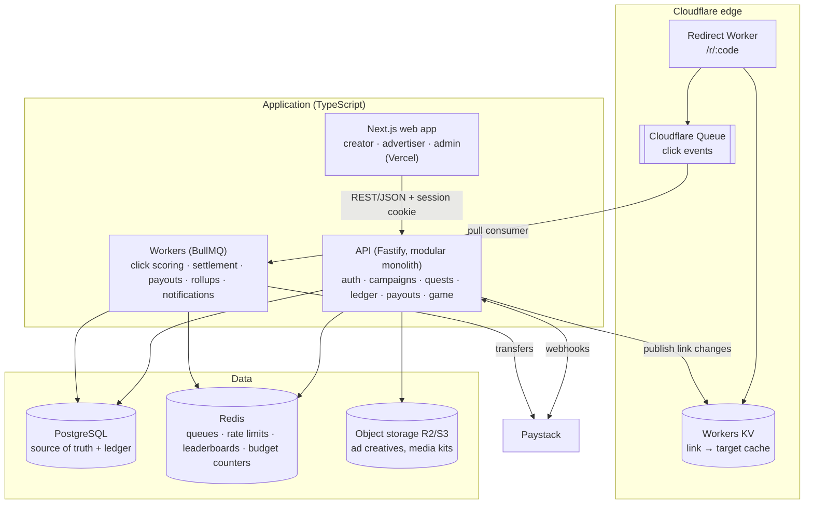
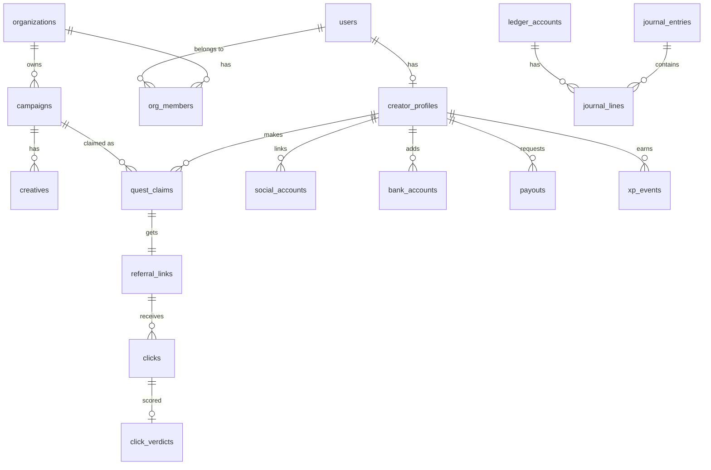

# HypeQuest — System Plan & Architecture

> Status: **Planning draft v1** (2026-10-06)
> Source: the single-file prototype in [`prototype/index.html`](../prototype/index.html)

HypeQuest is a two-sided marketplace for Nigeria. **Advertisers** fund
pay-per-click (CPC) campaigns. **Micro-influencers ("creators")** pick up
campaigns as *quests*, post the ad assets on TikTok / IG / X / WhatsApp Status
with a unique tracking link, and earn **85% of the CPC for every verified
click**. The platform keeps 15%. Game mechanics (XP, levels, energy,
leaderboards, guilds) drive engagement **and** double as the trust system.

---

## 1. What the prototype gets right, and what has to change

The prototype is a solid UX sketch. Moving it to a real product means these
changes:

| Prototype | Production |
|---|---|
| Creator and advertiser views mixed in one UI | Three separate surfaces: **Creator app**, **Advertiser portal**, **Admin console**, with role-based access |
| Wallet, XP and energy stored in `localStorage` | All money and progress live **on the server only**. The client is never trusted |
| `cpc * 0.85` with `toFixed(1)` (fractional naira) | Integer **kobo** amounts. A double-entry **ledger** is the source of truth for every balance |
| "Verified click web-hook" (simulated) | A real edge **redirect service**, an async **fraud-scoring pipeline**, and a **hold period** before earnings can be withdrawn |
| "Cash Out to Bank" toast | KYC, bank account name check, and Paystack/Flutterwave **transfers** |
| Hard-coded campaigns | Campaign lifecycle: draft → review → funded → live → paused/exhausted → closed |
| Energy (85/100) has no defined purpose | Energy **limits quest claims**, which stops link hoarding (§6) |
| ₦4M seasonal jackpot | Platform-funded, **skill-based** prize pool ranked on verified earnings (no element of chance, §11) |
| Tailwind CDN, `document.execCommand('copy')` | Built Tailwind with the same design tokens. `navigator.clipboard` with a fallback |

The visual identity carries over unchanged: the `cyber.*` and `brand.*`
colour tokens, Poppins, and the glass-panel cards.

---

## 2. Actors and surfaces



| Surface | Users | Main screens (mapped from the prototype) |
|---|---|---|
| **Creator app** (mobile-first PWA) | Influencers | Quests (`tab-quests`), Quest detail + link + media kit (`campaign-modal`), Loot Vault (`tab-vault`), Guild Rankings (`tab-guild`), Profile/KYC/Bank, Notifications |
| **Advertiser portal** | Brands and agencies (organisations with members) | Command Center (`tab-studio`), Create Campaign wizard (`advertiser-modal`), Wallet/Funding, Analytics, Invoices |
| **Admin console** | Internal ops | Campaign & creative review, Fraud queue, Payout approvals, User/KYC management, Ledger explorer, Season config |
| **Redirect edge** | Anonymous visitors | `https://hq.ng/r/{code}`: no UI, or a challenge page only when traffic looks risky |

---

## 3. High-level architecture

A **modular monolith** plus one **edge redirect worker**. The team is small
and the domain is money-sensitive, so the plan keeps few moving parts and
uses strong consistency in Postgres. Splitting into services can wait until a
real bottleneck shows up.



### Recommended stack

| Concern | Choice | Why |
|---|---|---|
| Language | **TypeScript** end-to-end | One language. Zod schemas shared between client and server |
| Monorepo | pnpm + Turborepo | `apps/*` and `packages/*` (§13) |
| Web | **Next.js (App Router)** + Tailwind + **Serwist** (PWA) | SSR for the advertiser/marketing pages, installable PWA for creators |
| API | **Fastify** + Zod + **Drizzle ORM** | Fast, explicit SQL control for ledger transactions |
| DB | **PostgreSQL 16** (Supabase or Neon managed; Supabase is already connected to this workspace) | ACID ledger, partitioning for clicks, row locks for budgets |
| Cache/queues | **Redis** (Upstash or managed) + **BullMQ** | Jobs, rate limits, sorted-set leaderboards |
| Redirect | **Cloudflare Workers** + KV + Queues | Under 50 ms redirects near Lagos, bot score / ASN / TLS fingerprint signals at the edge, absorbs viral spikes |
| Storage | Cloudflare R2 (S3 API) | No egress fees for creatives that get downloaded a lot |
| Payments | **Paystack** (primary), Flutterwave (fallback) | NGN card / transfer / USSD collection, NUBAN resolve, bulk transfers |
| KYC | Smile ID / Dojah / Prembly | BVN/NIN check and selfie liveness |
| Messaging | Termii (SMS + WhatsApp OTP), Resend (email), Web Push (VAPID) | Termii has good Nigerian delivery |
| Observability | OpenTelemetry → Grafana/Sentry, structured logs | Trace a click from the edge through scoring to the ledger |
| Infra-as-code | Terraform (Cloudflare, DB, Redis), GitHub Actions CI | Repeatable environments |

**Supabase alternative:** using Supabase for Auth, Postgres and Storage is a
reasonable way to start faster. Even then, **every money path (ledger, budget,
payouts) must go through the server-side API.** Do not use client SDK writes
with RLS for these.

---

## 4. Domain modules (inside the monolith)

Each module owns its own tables and exposes a TypeScript service interface.
Modules do not reach into each other's tables.

| Module | Responsibility |
|---|---|
| `identity` | Accounts, phone/email OTP, sessions, roles, organisations (advertiser teams), devices |
| `creator` | Creator profile, linked social accounts, niches, state/city, tier, KYC status, bank accounts |
| `campaigns` | Campaign CRUD, targeting, creatives, moderation state, budget and caps, lifecycle state machine |
| `quests` | Quest claims, referral links (short codes), post-proof submissions, eligibility checks |
| `tracking` | Click ingestion consumer, fraud rules engine, verdicts, conversion pixel |
| `ledger` | Double-entry accounts and journal, balance queries, holds and releases, reversals |
| `payments` | Paystack collections (advertiser funding), webhooks, transfers (creator payouts), reconciliation |
| `game` | XP, levels, energy, streaks, badges, seasons, leaderboards, guilds |
| `notifications` | In-app inbox, web push, SMS/WhatsApp, email, with preference handling |
| `admin` | Review queues, audit log, feature flags, configuration (fee %, hold days, limits) |
| `analytics` | Hourly/daily rollups for advertiser and creator dashboards |

---

## 5. Core flow: from click to payout

This flow is the whole business, and the main risk is **click fraud**. Most
of the engineering effort goes here.

### 5.1 Claiming a quest

1. Creator taps **Accept Quest & Get Link**. The client calls `POST /quests/{campaignId}/claim`.
2. The API checks: campaign is `live` with budget left, creator meets the targeting rules (tier, niche, state, minimum level), creator has enough **energy**, and has no existing claim for this campaign.
3. The API creates a `referral_link` with a **random 8-character base62 code** (unguessable, not derived from the username), spends energy, and writes `code → {link_id, campaign_id, target_url, status}` to Workers KV.
4. Response: link `https://hq.ng/r/Xk29PqLm`, creatives, suggested captions, and the required disclosure text (`#ad` / `#sponsored`).

> The prototype's `?r=user_id&ad=campaign_slug` format leaks identities and
> can be tampered with. Use opaque codes instead.

### 5.2 The redirect (edge, hot path)

```mermaid
sequenceDiagram
  participant V as Visitor (in-app browser)
  participant W as Redirect Worker (edge)
  participant KV as Workers KV
  participant Q as Click Queue
  participant S as Scoring Worker
  participant DB as Postgres (ledger)
  participant LP as Landing page

  V->>W: GET /r/Xk29PqLm
  W->>KV: lookup code
  KV-->>W: link_id, campaign_id, target_url, status
  W->>W: collect signals (IP, ASN, country, UA, JA4, CF bot score, headers, hq_vid cookie)
  alt high-risk signals
    W-->>V: lightweight Turnstile challenge page, then continue
  end
  W-)Q: enqueue ClickEvent{click_id (ULID), link_id, signals, ts}
  W-->>V: 302 → target_url?hq_click=click_id  (+ Set-Cookie hq_vid)
  V->>LP: loads advertiser page
  Q-)S: batch of click events
  S->>S: run fraud rules → verdict
  S->>DB: insert click + verdict; if VALID: reserve budget + journal entries (pending)
```

- The worker **never blocks on the database.** It enqueues and redirects. If KV has no entry, it falls back to an API lookup. Paused or exhausted campaigns still redirect (so the visitor isn't left on a dead link) but are recorded as `not_billable`.
- `hq_click` is appended so advertisers can report conversions later (Phase 2).
- Click IDs are ULIDs: sortable and unique, and they double as idempotency keys.

### 5.3 Fraud rules (rules engine v1)

Each rule adds to a risk score or forces a verdict. The output is
`valid | invalid(reason) | review`.

| # | Signal | Rule |
|---|---|---|
| 1 | Edge bot score / known bot UA / headless markers | Invalid |
| 2 | ASN is a datacenter, VPN or hosting provider | Invalid (high risk) |
| 3 | Geo outside campaign targeting (default: NG) | `not_billable` |
| 4 | Same visitor (`hq_vid` cookie, or a fingerprint hash of UA + accept-language + JA4 + IP /24) on the same **campaign** within 24 h, through *any* creator | Duplicate, not billable. This stops creators swapping links with each other |
| 5 | Visitor matches the **creator's own** device or session fingerprint | Invalid (self-click) |
| 6 | Link velocity is far above the creator's baseline, or clicks arrive in suspiciously regular intervals | `review`, and the link is auto-throttled |
| 7 | Very short time between link creation and a burst of clicks with no referrer from a social platform | Higher risk score |
| 8 | Per-creator daily cap per campaign (set by the advertiser) is reached | `not_billable` |
| 9 | Optional: landing-page beacon (advertiser adds a JS snippet) confirms the page actually loaded or stayed open more than 3 s | Turns "click" into "engaged click", which supports a higher CPC tier |

**Nigeria-specific caution:** MTN, Airtel and Glo use **carrier-grade NAT**,
so thousands of real people share one public IP. **Never deduplicate on IP
alone.** Treat IP as a weak signal and combine it with the cookie, UA and TLS
fingerprint. In-app browsers (TikTok, Instagram, WhatsApp) often drop cookies
between sessions, so the fingerprint hash is the fallback.

Every verdict stores its reasons and the rule-set version. Clicks can be
**re-scored retroactively** during the hold period when rules get better.

### 5.4 Budget reservation

When a click is valid, one Postgres transaction does the following:

```sql
UPDATE campaigns
   SET spent_kobo = spent_kobo + :cpc
 WHERE id = :campaign_id
   AND status = 'live'
   AND spent_kobo + :cpc <= budget_kobo
RETURNING spent_kobo;
-- 0 rows → budget exhausted: click = not_billable, campaign → 'exhausted', purge KV
```

…followed by the journal entries in §7, all in the same transaction. Postgres
row-level locking makes concurrent clicks safe. At very high throughput (well
over 500 billable clicks per second on one campaign), switch to Redis
`DECRBY` pre-reservation with periodic settlement into Postgres.

### 5.5 Hold, release and clawback

- Earnings land in the creator's **pending** balance. After **N days** (default 7, shorter at higher levels), a settlement job moves them to **available**.
- If fraud is confirmed during the hold, the click is reversed: creator pending −, platform fee −, campaign escrow +. The advertiser only pays for clicks that survive the hold.
- After release, earnings are final for the creator. Fraud found later is handled through account action and future earnings, not negative balances.

### 5.6 Withdrawal

1. Creator adds a bank account. The API calls Paystack **Resolve Account Number** and requires the account name to fuzzy-match the KYC name.
2. `POST /payouts`: checks minimum (for example ₦2,000), available balance, daily limit by KYC tier, and the account's cooling-off period after a bank change (24–72 h).
3. Ledger: available → `payouts_in_transit`. A job sends a Paystack **Transfer** with the payout ID as the idempotency reference.
4. Webhook `transfer.success` → in_transit → cleared. `transfer.failed/reversed` → money goes back to available, and the creator is notified.
5. MVP: an admin approves payouts manually. Later: automatic approval below a risk threshold.

---

## 6. Gamification design (engagement that also builds trust)

Game state is earned **only from verified, settled activity**. Otherwise
fraudsters would farm levels the same way they farm clicks.

| Mechanic | Rules (initial; all configurable in admin) |
|---|---|
| **XP** | +10 when claiming a quest. +1 per valid click **after release** (daily cap). +50 the first time a quest gets 10 valid clicks. +25 for an approved post-proof. Daily login streak bonus. −XP when fraud is confirmed |
| **Levels** | XP curve `xp(L) = 100·L^1.6`. Levels unlock **trust perks**: shorter hold period, higher daily withdrawal limit, access to premium (higher-CPC) campaigns, more energy |
| **Energy** | Max 100 (more at higher levels). Claiming a quest costs 10–25 depending on campaign tier. Regenerates +1 every 15 min. This limits link spraying and pushes creators to pick campaigns they will actually post |
| **Streaks** | Days in a row with at least one valid click. Badges at 7, 30 and 100 days |
| **Badges** | Niche badges ("Tech Titan"), "First ₦10k", "Clean Record 90d" (no fraud flags) |
| **Seasons & leaderboards** | 4–8 week seasons. Ranked by **verified, released earnings** (not raw clicks). Global, by state (Lagos, Abuja…), by niche. Stored in Redis sorted sets and rebuilt nightly from Postgres |
| **Guilds** (Phase 3) | Teams of up to 20. Guild leaderboard, guild quests ("guild hits 5,000 valid clicks"), shared cosmetic rewards. Guild members cannot earn from each other's links |
| **Prize pool** | Platform-funded marketing budget paid to the top N at season end, after a fraud audit |

---

## 7. Money: the ledger

All amounts are `BIGINT` **kobo** (₦1 = 100 kobo). Every transaction is a
journal entry whose lines sum to **zero**. Balances are derived from journal
lines (with cached balance rows updated in the same transaction). There is no
free-floating `balance` column that code can change directly.

### Accounts

| Account | Type | Per |
|---|---|---|
| `psp_clearing` | asset | platform: money held at Paystack |
| `advertiser_wallet` | liability | advertiser org |
| `campaign_escrow` | liability | campaign |
| `creator_pending` | liability | creator |
| `creator_available` | liability | creator |
| `payouts_in_transit` | liability | platform |
| `platform_revenue` | revenue | platform |
| `vat_payable` | liability | platform |
| `promo_prize_pool` | expense | platform |

### Journal templates

| Event | Debit | Credit |
|---|---|---|
| Advertiser funds ₦1,000,000 (Paystack `charge.success`) | `psp_clearing` | `advertiser_wallet` |
| Campaign launched with ₦500,000 budget | `advertiser_wallet` | `campaign_escrow` |
| Valid click, CPC ₦500 | `campaign_escrow` 50,000k | `creator_pending` 42,500k · `platform_revenue` 7,500k |
| Hold released | `creator_pending` | `creator_available` |
| Click reversed (fraud) | `creator_pending` · `platform_revenue` | `campaign_escrow` |
| Creator withdraws | `creator_available` | `payouts_in_transit` |
| Transfer succeeds | `payouts_in_transit` | `psp_clearing` |
| Campaign closed with unspent budget | `campaign_escrow` | `advertiser_wallet` |
| Advertiser withdraws or refunds | `advertiser_wallet` | `psp_clearing` |

**Split rounding:** `creator = floor(cpc × 8500 / 10000)` and
`platform = cpc − creator`. The platform absorbs any rounding, and fee
percentages are stored per campaign so changing the fee never rewrites
history.

**Pricing note to decide:** the prototype charges "budget = CPC × clicks". You
still need to decide whether **VAT (7.5%)** on the platform's fee and the
**payment processor fees** are added on top when the advertiser funds, or
absorbed by the platform. Recommendation: show advertisers a funding total of
budget + processor fee + VAT on the platform portion, and itemise it on the
invoice.

**Reconciliation:** a daily job compares the ledger's `psp_clearing` with the
Paystack balance and settlement reports, and alerts on any difference.

---

## 8. Data model (core tables)



| Table | Key columns |
|---|---|
| `users` | id, phone (unique), email, password_hash/null, role_flags, status, created_at |
| `creator_profiles` | user_id, handle, display_name, avatar_url, state, niches[], tier, level, xp, energy, energy_updated_at, kyc_status, kyc_name, risk_score |
| `social_accounts` | id, creator_id, platform (tiktok/ig/x/whatsapp/youtube), handle, followers, verified_at, verification_method |
| `organizations` | id, name, rc_number (CAC), billing_email, status |
| `org_members` | org_id, user_id, role (owner/admin/analyst) |
| `campaigns` | id, org_id, title, slug, description, category, landing_url, cpc_kobo, creator_share_bps (8500), budget_kobo, spent_kobo, daily_cap_kobo, per_creator_daily_click_cap, targeting (jsonb: states, niches, min_level, platforms), starts_at, ends_at, status, arcon_ref, moderation_notes |
| `creatives` | id, campaign_id, type (image/video/caption), storage_key, width, height, duration, status |
| `quest_claims` | id, campaign_id, creator_id, energy_spent, claimed_at, post_proof_url, proof_status — unique(campaign_id, creator_id) |
| `referral_links` | id, claim_id, code (unique), status (active/throttled/disabled) |
| `clicks` | id (ULID), link_id, campaign_id, creator_id, ts, ip_hash, asn, country, ua_hash, fp_hash, visitor_id, referrer_host, edge_bot_score — **partitioned by month** |
| `click_verdicts` | click_id, verdict, reasons[], ruleset_version, billed_kobo, journal_entry_id, released_at, reversed_at |
| `ledger_accounts` | id, type, owner_type, owner_id, currency, cached_balance_kobo |
| `journal_entries` | id, kind, idempotency_key (unique), ref_type, ref_id, created_at |
| `journal_lines` | entry_id, account_id, amount_kobo (signed) — CHECK that each entry sums to 0 (deferred constraint or enforced in the service) |
| `payments` | id, org_id, provider, reference (unique), amount_kobo, status, raw_webhook |
| `bank_accounts` | id, creator_id, bank_code, account_number_enc, account_name, recipient_code, verified_at |
| `payouts` | id, creator_id, bank_account_id, amount_kobo, status, provider_ref, approved_by, failure_reason |
| `xp_events` | id, creator_id, kind, amount, ref_id, created_at |
| `seasons`, `season_standings`, `badges`, `creator_badges`, `guilds`, `guild_members` | game tables |
| `notifications` | id, user_id, kind, payload, read_at |
| `audit_log` | id, actor_id, action, target_type, target_id, before, after, ip, ts (append-only) |
| `click_rollups_hourly` | campaign_id, creator_id, hour, clicks, valid, invalid, billed_kobo |

**PII:** store hashed IPs (salted, rotated monthly) and encrypt bank account
numbers and KYC payloads at the application level (envelope encryption with a
KMS key).

---

## 9. API surface (v1, REST + JSON)

```
Auth
  POST /auth/otp/request        {phone|email}
  POST /auth/otp/verify         → session cookie (httpOnly, SameSite=Lax)
  POST /auth/logout
  GET  /me

Creator
  GET  /quests?category=&sort=payout|new&cursor=
  GET  /quests/:campaignId
  POST /quests/:campaignId/claim            → referral link
  POST /quests/:campaignId/proof            {post_url}
  GET  /quests/:campaignId/media-kit        → signed zip URL
  GET  /me/links                            per-link stats
  GET  /me/wallet                           pending / available / lifetime
  GET  /me/earnings?cursor=                 "loot drops" feed
  POST /me/bank-accounts   GET /banks       (Paystack bank list, cached)
  POST /me/kyc
  POST /payouts            GET /payouts
  GET  /me/game                             xp, level, energy, streak, badges
  GET  /leaderboards/:season?scope=global|state:LA|niche:tech

Advertiser (scoped to org)
  GET/POST/PATCH /orgs/:orgId/campaigns
  POST /orgs/:orgId/campaigns/:id/creatives  → presigned upload URL
  POST /orgs/:orgId/campaigns/:id/submit     → moderation queue
  POST /orgs/:orgId/campaigns/:id/pause|resume|close
  GET  /orgs/:orgId/campaigns/:id/analytics?granularity=hour|day
  POST /orgs/:orgId/wallet/fund              → Paystack checkout URL
  GET  /orgs/:orgId/wallet  /invoices

Admin
  GET  /admin/review/campaigns  POST .../:id/approve|reject
  GET  /admin/fraud/queue       POST /admin/clicks/:id/verdict
  POST /admin/links/:id/disable  POST /admin/users/:id/suspend
  GET  /admin/payouts?status=pending  POST .../:id/approve|reject
  GET  /admin/ledger/accounts/:id
  PUT  /admin/config/:key

Webhooks / edge
  POST /webhooks/paystack        (HMAC-SHA512 signature check, idempotent on event id)
  GET  /r/:code                  (Cloudflare Worker, not the API)
  GET  /px.gif?c=click_id&e=view|lead|purchase   (conversion pixel, Phase 2)
```

Rules: cursor pagination, an `Idempotency-Key` header on every POST that
moves money, Zod-validated input and output, and rate limits in Redis (per
user, per IP, plus stricter limits on OTP and payout endpoints).

---

## 10. Security

- **Auth:** phone OTP (Termii) as the main login, which suits Nigeria. Optional email/password and Google. Server-side sessions in Redis. **2FA is required** for advertiser owners and all admins.
- **RBAC:** `creator`, `org:owner|admin|analyst`, `admin:ops|finance|super`. Payout approval and ledger adjustments need the `finance` role, and adjustments above a threshold need **two-person approval**.
- **Money safety:** idempotency keys everywhere, every money mutation in a DB transaction, webhook signature checks, a daily reconciliation job, an append-only audit log, and no `UPDATE`/`DELETE` on journal tables (enforced by DB grants).
- **Account takeover:** a new bank account or new device triggers a cooling-off period before withdrawals. Alerts on login from a new device. SIM-swap risk is reduced by requiring KYC selfie re-verification for large withdrawals.
- **Content:** creative uploads go through presigned URLs, MIME and size checks, a malware scan and image re-encoding. Landing URLs are checked against Google Safe Browsing and re-checked periodically, so the redirect can't be used as an open redirect to phishing pages.
- **Web:** CSP, httpOnly cookies, CSRF protection on cookie-authenticated routes, dependency scanning and secret scanning in CI.

---

## 11. Compliance & policy (Nigeria) — get legal advice before launch

| Area | Implication |
|---|---|
| **NDPA 2023 / NDPC** | Privacy notice, lawful basis, consent for marketing, retention schedule, DPO, data-breach process. Possibly registration as a data controller of major importance |
| **ARCON** (Advertising Regulatory Council) | Ads shown in Nigeria may need pre-exposure vetting. Store `arcon_ref` per campaign and make advertisers attest to compliance in the ToS |
| **Influencer disclosure** | Make creators include `#ad`/`#sponsored` (show it in caption templates, check it in post-proof review) |
| **Holding funds** | Don't operate as an unlicensed wallet or e-money issuer. Keep funds with the licensed PSP (Paystack/Flutterwave) and present balances as earned receivables. Confirm the structure with counsel and the PSP |
| **KYC / AML** | BVN or NIN check before the first withdrawal. Tiered limits. Sanctions/PEP screening through the KYC provider for advertisers |
| **Tax** | VAT on the platform fee, possible withholding tax, and creators' own income reporting. Itemised invoices |
| **Promotions** | Keep the seasonal prize **skill/performance-based**. Prizes decided by chance can fall under lottery or sales-promotion rules |
| **Prohibited categories** | No gambling, unlicensed loan apps, crypto schemes or adult content without approval (loan apps and Ponzi-style "investment" ads are a known local abuse vector) |

---

## 12. Non-functional targets & scale

| Metric | MVP target |
|---|---|
| Redirect latency (p95, Lagos) | < 80 ms |
| Redirect availability | 99.95% (the edge keeps redirecting even if the API is down; events queue up) |
| Click → verdict | < 60 s p95 |
| Creator dashboard freshness | ≤ 5 min (rollups) |
| Initial load on 3G, low-end Android | < 3 s, JS < 200 KB on creator routes |
| Data | 1–5M clicks per month in Year 1. Postgres monthly partitions are enough. Move analytics to ClickHouse if clicks go past ~50M per month |

**Mobile and data cost:** many users are on prepaid data. Use compressed
images (AVIF/WebP), lazy-load the media kit, cache the app shell in the
service worker, and allow downloading creatives over Wi-Fi only.

**Offline (PWA):** the app shell and the last-viewed quests/wallet are cached
read-only. Actions that need the server (claim, withdraw) show a clear
"you're offline" state. Unlike in the prototype, nothing financial is stored
in `localStorage`.

---

## 13. Repository layout

```
hypepromo/
├─ apps/
│  ├─ web/            Next.js — (creator)/, (advertiser)/, (admin)/ route groups, PWA
│  ├─ api/            Fastify modular monolith — src/modules/<module>/
│  ├─ worker/         BullMQ processors + Cloudflare Queue consumer
│  └─ redirect/       Cloudflare Worker (/r/:code, /px.gif)
├─ packages/
│  ├─ db/             Drizzle schema, migrations, seed data
│  ├─ shared/         Zod schemas, money helpers (kobo), types, constants
│  ├─ fraud-rules/    pure, versioned rule functions (shared by worker + tests)
│  ├─ ui/             design system (cyber/brand tokens from the prototype)
│  └─ config/         eslint, tsconfig, tailwind preset
├─ infra/             Terraform, environment configs
├─ docs/              this document, ADRs, runbooks
└─ prototype/         original single-file prototype (reference only)
```

**Environments:** `local` (docker-compose: Postgres, Redis, MinIO, Paystack
test keys, `wrangler dev`), `staging` (Paystack test mode, seeded data), and
`production`.

**CI:** lint, typecheck, unit tests, integration tests against ephemeral
Postgres, migration check, Playwright end-to-end tests of the main flows, and
preview deploys per PR.

### Testing priorities

1. **Ledger property tests:** every entry sums to zero, balances never go negative, and replaying events is idempotent.
2. **Fraud rule table tests:** labelled click fixtures → expected verdicts, plus regression tests when rules change.
3. **Concurrency tests:** 1,000 parallel valid clicks on a campaign with budget for 500 → exactly 500 billed.
4. **Webhook replay tests:** duplicate and out-of-order Paystack events.
5. **End-to-end tests:** advertiser funds and launches → creator claims → simulated clicks → hold release → withdrawal.

---

## 14. Delivery roadmap

Assumes 2–3 full-stack engineers, 1 designer (part-time) and 1 ops/finance
person.

### Phase 0 — Foundations (weeks 1–2)
- Monorepo, CI, environments, Terraform, Sentry/OTel
- Port the prototype's design tokens and components into `packages/ui`
- Auth (phone OTP), users, roles, organisations
- Ledger module and its property tests (built **first**, because everything depends on it)

### Phase 1 — Closed-beta MVP (weeks 3–10)
- Creator onboarding: profile, social handles (verified by putting a code in the bio), niches, state
- Campaigns created by advertisers or by admins for launch partners, creative upload, moderation
- Advertiser funding through Paystack, plus a bank-transfer option for large budgets
- Quest feed, claim, referral link, caption + `#ad` template, single-image download
- Redirect worker, click queue, rules engine v1, budget reservation, 7-day hold
- Creator wallet (pending/available), earnings feed, bank account + KYC, **manually approved** withdrawals
- Basic XP, levels, energy
- Advertiser dashboard: clicks, valid %, spend, by creator and by day
- Admin: review queues, fraud queue, payouts, audit log
- **Beta:** 3–5 advertisers, 200–500 hand-picked creators in Lagos and Abuja

### Phase 2 — Public launch (weeks 11–18)
- Self-serve advertiser onboarding with CAC/RC verification
- Targeting (state, niche, level, platform), daily caps, scheduling
- Conversion pixel and CPA/CPL campaign option, using `hq_click` attribution
- Automatic payouts below a risk threshold, retries, reconciliation dashboard
- Seasons, leaderboards (global/state/niche), badges, streaks
- Web push, WhatsApp notifications, media-kit zips, post-proof review
- Risk-based Turnstile interstitial, velocity anomaly detection

### Phase 3 — Growth (after week 18)
- Guilds and guild quests
- OAuth social verification and follower sync where platform APIs allow it
- Capacitor wrappers for the Play Store (and iOS if needed)
- ML fraud scoring trained on labelled verdicts, ClickHouse analytics
- Agency accounts (multi-brand), API access for advertisers
- Expansion to Ghana and Kenya (multi-currency ledger already supported by `currency` on accounts)

---

## 15. Key metrics

- **Marketplace:** GMV (campaign spend), take rate, creator payouts, number of live campaigns, budget usage
- **Quality:** valid-click rate, reversal rate, advertiser repeat-funding rate, cost per conversion (Phase 2)
- **Creators:** activation (first valid click within 7 days), D7/D30 retention, median monthly earnings, withdrawal success rate
- **Ops:** payout turnaround time, size of the fraud queue, reconciliation differences (target ₦0)

---

## 16. Open decisions for the owner

1. **Pricing model:** pure CPC only, or also CPA/CPL in Phase 2? (Advertisers trust CPA more, and it is much harder to game.)
2. **Fee and charges:** is the 15% inclusive of VAT? Who pays processor fees on funding and on payouts?
3. **Minimum CPC** and the minimum campaign budget (suggestion: ₦50 CPC, ₦50,000 budget).
4. **Hold period** at launch (suggestion: 7 days, shrinking to 2 days at high levels).
5. **Creator eligibility:** minimum follower count, or open to anyone with a WhatsApp Status? (WhatsApp Status is huge in Nigeria but cannot be verified, so it has higher fraud risk.)
6. **Who launches the first campaigns:** a sales-led managed service at first, or self-serve from day one?
7. **Hosting preference:** Supabase-managed Postgres/Auth (already connected) or plain managed Postgres plus our own auth?
8. **Seasonal prize pool** size and funding source.
9. **Brand name and domains:** `hypequest.ng` plus a short redirect domain (for example `hq.ng`, if available).
